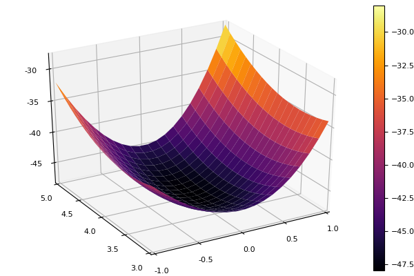
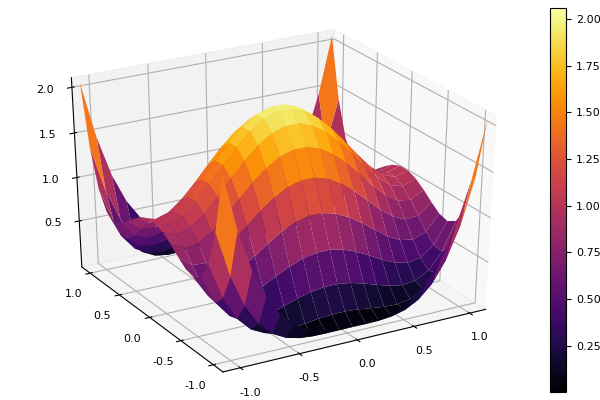
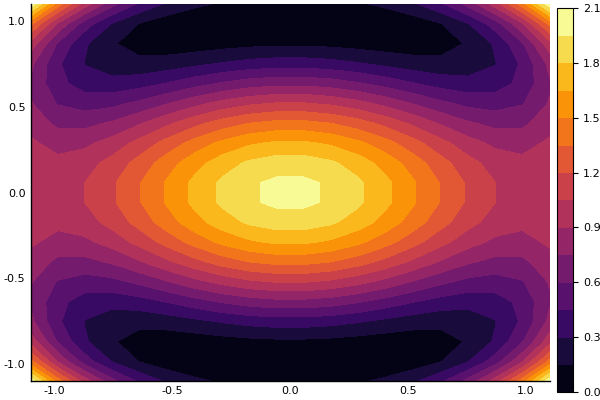

Worksheet 2 Gradient and Hessian
by Prof J.Morlier February 2020

#import Base.print_matrix
#import Pkg; Pkg.add("SymPy")


```julia
using LinearAlgebra, SparseArrays, SuiteSparse, Random
using SymPy
using Plots; pyplot()
import Base.print_matrix


```


```julia
versioninfo()
```

    Julia Version 1.3.1
    Commit 2d5741174c (2019-12-30 21:36 UTC)
    Platform Info:
      OS: macOS (x86_64-apple-darwin18.6.0)
      CPU: Intel(R) Core(TM) i5-8259U CPU @ 2.30GHz
      WORD_SIZE: 64
      LIBM: libopenlibm
      LLVM: libLLVM-6.0.1 (ORCJIT, skylake)


#1

A 2x2 Recap


```julia
entries = @syms x1 x2  real=true

```


    (x1, x2)


```julia
J=2*x1^3 +3*x2^2 +3*x2*x1^2 -24*x2

```


\begin{equation*}2 x_{1}^{3} + 3 x_{1}^{2} x_{2} + 3 x_{2}^{2} - 24 x_{2}\end{equation*}


Gradient computing


```julia
dJdx1=diff(J,x1)  ;

dJdx2=diff(J,x2) ;

dJ=[dJdx1; dJdx2]
```


\[ \left[ \begin{array}{r}6 x_{1}^{2} + 6 x_{1} x_{2}\\3 x_{1}^{2} + 6 x_{2} - 24\end{array} \right] \]


Hessian computing


```julia
Hdx11=diff(dJdx1,x1);
```


```julia
Hdx12=diff(dJdx2,x1);
```


```julia
Hdx21=diff(dJdx2,x1);
```


```julia
Hdx22=diff(dJdx2,x2);
```


```julia
H=[Hdx11 Hdx12; Hdx21 Hdx22]
```


\[\left[ \begin{array}{rr}12 x_{1} + 6 x_{2}&6 x_{1}\\6 x_{1}&6\end{array}\right]\]


substitute with Saddle Point (0,4);(4,-4);(-2,2)


```julia
A=[Hdx11(0,4) Hdx12(0,4); Hdx21(0,4) Hdx22(0,4)]

```


\[\left[ \begin{array}{rr}48&0\\0&6\end{array}\right]\]


```julia
det(A)
```


\begin{equation*}288\end{equation*}


#2


```julia
tr(A)
```


\begin{equation*}54\end{equation*}


```julia
Lambda=eigvals(A)
```


\[ \left[ \begin{array}{r}48\\6\end{array} \right] \]


Since both eigenvalues are positive, we conclude that the function takes a (local) minimum at p*=(x1*,x2*)=(0,4).
One can indeed confirm this by plotting the function around this point in Matlab. 


```julia
x=range(-1,stop=1,length=20)
y=range(3,stop=5,length=20)
f(x,y) = 2*x^3 +3*y^2 +3*y*x^2 -24*y
plot(x,y,f,st=:surface,camera=(-30,30))
```





```julia
function gradient2(J,x1,x2)

dJdx1=diff(J,x1)  ;

dJdx2=diff(J,x2) ;
dJ=[dJdx1; dJdx2]
return dJ
end
```


    gradient2 (generic function with 1 method)


```julia
function hessian2(dJ,x1,x2)
    
Hdx11=diff(dJ[1],x1);
Hdx12=diff(dJ[1],x2);

Hdx21=diff(dJ[2],x1);

Hdx22=diff(dJ[2],x2);
H=[Hdx11 Hdx12; Hdx21 Hdx22]
return H
end
```


    hessian2 (generic function with 1 method)


```julia
#2
```


```julia
J=(x1^2 +x2^2 -1)^2 + (x2^2 -1)^2
```


\begin{equation*}\left(x_{2}^{2} - 1\right)^{2} + \left(x_{1}^{2} + x_{2}^{2} - 1\right)^{2}\end{equation*}


```julia
dJ=gradient2(J,x1,x2)
```


\[ \left[ \begin{array}{r}4 x_{1} \left(x_{1}^{2} + x_{2}^{2} - 1\right)\\4 x_{2} \left(x_{2}^{2} - 1\right) + 4 x_{2} \left(x_{1}^{2} + x_{2}^{2} - 1\right)\end{array} \right] \]


```julia
H=hessian2(dJ,x1,x2)
```


\[\left[ \begin{array}{rr}12 x_{1}^{2} + 4 x_{2}^{2} - 4&8 x_{1} x_{2}\\8 x_{1} x_{2}&4 x_{1}^{2} + 24 x_{2}^{2} - 8\end{array}\right]\]


substitute with Saddle Point (0,0);etc..


```julia
A=[H[1,1](0,0) H[1,2](0,0); H[2,1](0,0) H[2,2](0,0)]
```


\[\left[ \begin{array}{rr}-4&0\\0&-8\end{array}\right]\]


```julia
det(A)
```


\begin{equation*}32\end{equation*}


```julia
tr(A)
```


\begin{equation*}-12\end{equation*}


```julia
Lambda=eigvals(A)
```


\[ \left[ \begin{array}{r}-8\\-4\end{array} \right] \]


Since both eigenvalues are negative, we conclude that the function takes a (local) maximum at p*=(x1*,x2*)=(0,0).
One can indeed confirm this by plotting the function around this point in Matlab. 


```julia
x=range(-1.1,stop=1.1,length=20)
y=range(-1.1,stop=1.1,length=20)
f(x,y) = (x^2 +y^2 -1)^2 + (y^2 -1)^2
plot(x,y,f,st=:surface,camera=(-30,30))
```





```julia
plot(x,y,f,st=:contourf,camera=(-0,0))
```





