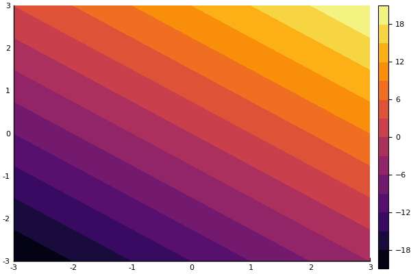

# Worksheet 4 Unconstrained optimization 
## J.Morlier March 2020


# On the descent direction 


```julia
using LinearAlgebra, SparseArrays, SuiteSparse, Random
using SymPy
using Plots; pyplot()
import Base.print_matrix


```


```julia
versioninfo()
```

    Julia Version 1.3.1
    Commit 2d5741174c (2019-12-30 21:36 UTC)
    Platform Info:
      OS: macOS (x86_64-apple-darwin18.6.0)
      CPU: Intel(R) Core(TM) i5-8259U CPU @ 2.30GHz
      WORD_SIZE: 64
      LIBM: libopenlibm
      LLVM: libLLVM-6.0.1 (ORCJIT, skylake)


```julia
entries = @syms x1 x2  real=true
```


    (x1, x2)


Consider the function f : R2 → R given by J(x) = x1^3+x^2 +2*x2. Give some descent directions for J at the point [1,1]⊤. Is there any descent direction at the point [0, −1]⊤ ? Justify the answer.


```julia
J=x1^3 +x2^2 +2*x2
```


\begin{equation*}x_{1}^{3} + x_{2}^{2} + 2 x_{2}\end{equation*}


```julia
dJdx1=diff(J,x1)  ;

dJdx2=diff(J,x2) ;

dJ=[dJdx1; dJdx2]
```


\[ \left[ \begin{array}{r}3 x_{1}^{2}\\2 x_{2} + 2\end{array} \right] \]


substitute with Point (1,1);


```julia
A=[dJdx1(1) ; dJdx2(1)]
```


\[ \left[ \begin{array}{r}3\\4\end{array} \right] \]


Create vector of possible descent directions


```julia
entries = @syms d1 d2  real=true
```


    (d1, d2)


```julia
dir=A'*[d1; d2]
```


\begin{equation*}3 d_{1} + 4 d_{2}\end{equation*}


```julia
x=range(-3,stop=3,length=20)
y=range(-3,stop=3,length=20)
f(x,y) = 3*x+4*y
plot(x,y,f,st=:contourf,camera=(0,0))
```





It's up to you to choose one possible solution	such that 3d1 + 4d2 < 0				

substitute with (0,-1). Something wrong?


```julia
dJdx1
```


\begin{equation*}3 x_{1}^{2}\end{equation*}


```julia
dJdx2

```


\begin{equation*}2 x_{2} + 2\end{equation*}


```julia
A=[dJdx1(0) ; dJdx2(-1)]
```


\[ \left[ \begin{array}{r}0\\0\end{array} \right] \]


```julia

dir=A'*[d1; d2]
```


\begin{equation*}0\end{equation*}


thus one cannot find a descent direction at the point.

# On the optimal step-size 


Compute the optimal step-size at [5, 1]⊤ following the direction d = −∇f (5, 1). 


```julia
J=0.5*x1^2 + 4.5*x2^2
```


\begin{equation*}0.5 x_{1}^{2} + 4.5 x_{2}^{2}\end{equation*}


```julia
dJdx1=diff(J,x1)  ;

dJdx2=diff(J,x2) ;

dJ=[dJdx1; dJdx2]
```


\[ \left[ \begin{array}{r}1.0 x_{1}\\9.0 x_{2}\end{array} \right] \]


```julia
entries = @syms alpha  real=true
```


    (alpha,)


```julia
d=-dJ
```


\[ \left[ \begin{array}{r}- 1.0 x_{1}\\- 9.0 x_{2}\end{array} \right] \]


```julia
x=[x1;x2]
```


\[ \left[ \begin{array}{r}x_{1}\\x_{2}\end{array} \right] \]


```julia
Jnew=(0.5*newx[1]^2 + 4.5*newx[2]^2)

```


\begin{equation*}0.5 \left(- 1.0 \alpha x_{1} + x_{1}\right)^{2} + 364.5 \left(- \alpha x_{2} + 0.111111111111111 x_{2}\right)^{2}\end{equation*}


```julia
Jnew=factor(Jnew)
```


\begin{equation*}364.5 \left(0.00137174211248285 \alpha^{2} x_{1}^{2} + 1.0 \alpha^{2} x_{2}^{2} - 0.00274348422496571 \alpha x_{1}^{2} - 0.222222222222222 \alpha x_{2}^{2} + 0.00137174211248285 x_{1}^{2} + 0.0123456790123457 x_{2}^{2}\right)\end{equation*}


```julia
dJda=(diff(Jnew,alpha))
```


\begin{equation*}1.0 \alpha x_{1}^{2} + 729.0 \alpha x_{2}^{2} - 1.0 x_{1}^{2} - 81.0 x_{2}^{2}\end{equation*}


substitute with [5,1]


```julia
dJda(x1=>5, x2=>1)
```


\begin{equation*}754.0 \alpha - 106.0\end{equation*}


```julia

```


```julia
alpha_star=106/754
```


    0.14058355437665782


# On the Newton method 

For a given starting point x(0) = [x1, x2]⊤, compute the Newton direction at this point. 


```julia
function gradient2(J,x1,x2)

dJdx1=diff(J,x1)  ;

dJdx2=diff(J,x2) ;
dJ=[dJdx1; dJdx2]
return dJ
end
```


    gradient2 (generic function with 1 method)


```julia
function hessian2(dJ,x1,x2)
    
Hdx11=diff(dJ[1],x1);
Hdx12=diff(dJ[1],x2);

Hdx21=diff(dJ[2],x1);

Hdx22=diff(dJ[2],x2);
H=[Hdx11 Hdx12; Hdx21 Hdx22]
return H
end
```


    hessian2 (generic function with 1 method)


```julia
J=0.5*x1^2 + 4.5*x2^2
```


\begin{equation*}0.5 x_{1}^{2} + 4.5 x_{2}^{2}\end{equation*}


```julia
dJ=gradient2(J,x1,x2)
```


\[ \left[ \begin{array}{r}1.0 x_{1}\\9.0 x_{2}\end{array} \right] \]


```julia
H=hessian2(dJ,x1,x2)
```


\[\left[ \begin{array}{rr}1.0&0\\0&9.0\end{array}\right]\]


give newton's direction


```julia
d_0=-inv(H)*dJ
```


\[ \left[ \begin{array}{r}- 1.0 x_{1}\\- 1.0 x_{2}\end{array} \right] \]


it seems always negative? right ?  is a descent direction for J at the point x(0) 


```julia
xnew=x+d_0
```


\[ \left[ \begin{array}{r}0\\0\end{array} \right] \]


Hence, one gets in one iteration the optimal solution independently of the starting point (this is the case for all quadratic minimization problems) 

# Same question with a new function
For a given starting point x(0) = [x1, x2]⊤, compute the Newton direction at this point. 


```julia
J=x1^4 + 2*x2^2
```


\begin{equation*}x_{1}^{4} + 2 x_{2}^{2}\end{equation*}


```julia
dJ=gradient2(J,x1,x2)

```


\[ \left[ \begin{array}{r}4 x_{1}^{3}\\4 x_{2}\end{array} \right] \]


```julia
H=hessian2(dJ,x1,x2)
```


\[\left[ \begin{array}{rr}12 x_{1}^{2}&0\\0&4\end{array}\right]\]


```julia
d_0=-inv(H)*dJ
```


\[ \left[ \begin{array}{r}- \frac{x_{1}}{3}\\- x_{2}\end{array} \right] \]


it seems always negative? right ?  is a descent direction for J at the point x(0) 


```julia
xnew=x+d_0
```


\[ \left[ \begin{array}{r}\frac{2 x_{1}}{3}\\0\end{array} \right] \]


One iteration of the Newton method is not enough to converge to the optimal solution. 


```julia

```
